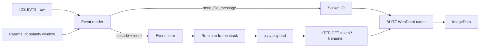

# Event reader (working title)

Standalone **EVT3 `.raw` archive reader** for IDS / Prophesee-style recordings.
Decodes the event stream, bins to dense frames with live Δt / polarity / window,
and feeds **BLITZ** over the **WOLKE** viewer contract (Socket.IO + HTTP `.npy`).

Not part of the BLITZ Flatpak/EXE. **Not FUNKE** (that name is reserved for a
later live / multi-format streamer — see WETTER `docs/funke.md`).



## Run from source

```bash
uv sync
uv run evt-sidecar /path/to/recording.raw
```

Defaults: `http://127.0.0.1:5055`, token `evt`. In BLITZ → **Network**, use that
address and token. Binaries: GitHub Releases (`EventReader.exe` / `EventReader`).

## Headless export

```bash
uv run evt-sidecar recording.raw --export-npy out.npy --dt-ms 1 --polarity both
```

## Parameters

| Control | Meaning |
|---------|---------|
| Δt | Bin width (ms) → one frame per bin |
| Polarity | `on` / `off` / `both` / `signed` (ON=+1, OFF=−1) |
| Window | Relative start/end (ms) |
| Max frames | Cap stack length (default 40; uint8 for Network) |
| Live apply | Debounced re-bin + push |

License: GPL-3.0-or-later. No Metavision SDK.
