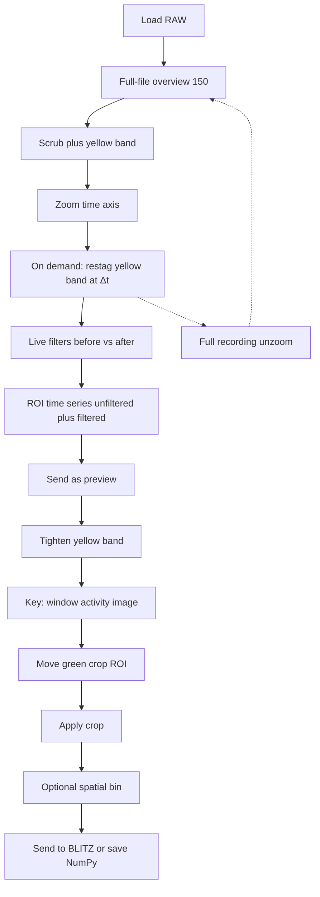
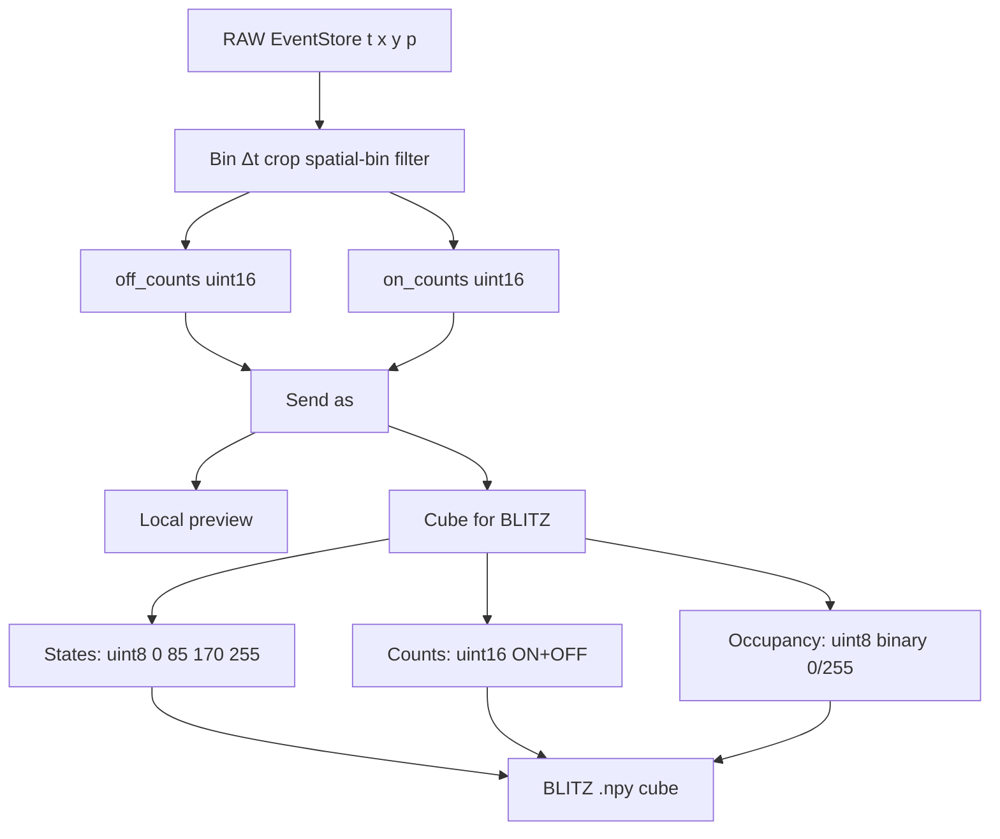
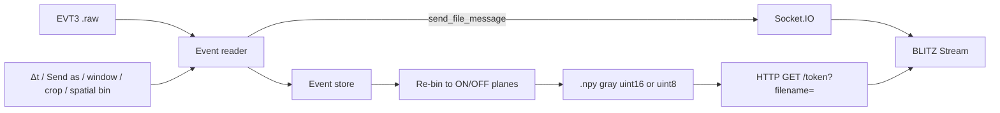

# Event reader

Open **event-camera recordings** (Prophesee / IDS **EVT3** `.raw`) and view them
in [BLITZ](https://github.com/PiMaV/BLITZ) as a normal image stack.

No Metavision / MDK install. The reader decodes the stream once; you choose the
time window, optional crop, spatial bin, and frame time (Δt), then send a dense `.npy` cube
over the same Network contract as **WOLKE** (Socket.IO + HTTP).

Not part of the BLITZ Flatpak or EXE. **Not FUNKE** — that name is reserved for
a later live / multi-cam streamer.



Internally the reader always bins **ON and OFF counts** (`uint16`). **Send as**
(states / counts / occupancy) is a view of those planes — switching it does
not re-bin. Preview colour follows Send as. Headless `--polarity` can still
pick ON / OFF / signed for counts and occupancy.



Transport after **Build pictures and send to BLITZ**:



## Download

Release binaries (no Python required):

- **Windows:** `EventReader.exe`
- **Ubuntu / Linux:** `EventReader`

from [GitHub Releases](https://github.com/PiMaV/event-reader/releases).
The one-file binary is around 140 MB (Qt + NumPy + Numba).

Run the binary (optional path to a `.raw` file). On Windows a console window
stays open for logs.

## Use with BLITZ

Nothing is sent until you click **Build pictures and send to BLITZ**.
The status and RAM bars live in panel **3 — Send to BLITZ** (decoding, sending,
BLITZ Stream connected / received — not a tiny traffic light).

1. **Open** a `.raw` file (**drop** it on the window, **Open RAW…**, or pass
   the path on the command line). The window shows the RAW header and first
   events (about ten lines) plus a coarse **overview** (~150 pictures, local
   only) as **two pictures**: left unfiltered, right after noise filters
   (pan/zoom stay locked; default view is the **whole frame**, letterboxed
   with slate blue — never a side crop; yellow box = BLITZ-style time-series
   probe). A new file resets Δt, filters, Send as, crop, and
   File-tab options to the same defaults as a fresh window.
   Black pixels are a measured zero (no events), not empty UI.
   The plot under the pictures is **events in that box** (sum of counts,
   not a mean): **cyan = unfiltered ROI**, **gold = filtered ROI** (once a
   filter is on). File-wide event rate is only shown before the overview
   exists.
   **Send as** is the one choice for what BLITZ gets (preview matches):
   **states** (default) — polarity as red / green / yellow, cube `uint8`
   0 / 85 / 170 / 255; **counts** — Inferno, cube `uint16` activity
   (ON+OFF); **occupancy** — black / white, cube `uint8` 0 or 255.
   Dropping a folder loads the first `.raw` in that folder.
2. **Scrub** the timeline under the image (click, drag the white playhead, or
   mouse wheel). Time is **seconds from the first event in this file**, not
   wall-clock. EVT3 ticks are 1 µs; the file does not store when you pressed
   record.
3. **Zoom time** with Ctrl+wheel or right-drag on the plot. Wheel without
   Ctrl still scrubs. Double-click the plot to reset to the full file (the
   coarse overview is cached). Drag the yellow box on either picture to
   move the ROI; both boxes stay linked and the plot follows.
4. Drag the **yellow band** to the range you will send. The handles sit
   slightly inside the plot so they are not on the window frame. That
   writes a **1-2-5 Δt** into panel 2 (~150 pictures in the band). Typing
   a custom **Δt** updates the RAM plan only — pictures catch up on
   **Rebuild overview for selection (O)** (or send). Rebuild zooms the
   timeline and re-bins at **that same Δt** — same integration as BLITZ.
   The pictures snap back to the
   **full frame** (leftover pan/zoom is dropped).
   **Full recording (Esc)** (or double-click the plot) restores the cached
   coarse full-file overview — it does not re-decode the `.raw`. A busy
   overlay stays up while that restore runs.
   Double-click a picture to fit the full frame again.
   Even/odd row imbalance is reported in the status bar. Compare **Before**
   (left) and **After** (right) while you scrub.
5. **Crop (M)** comes after the yellow band (buttons sit under the
   timeline, not on the picture). That opens one activity image; the view
   zooms out a little so the **green rectangle** handles sit in the blue
   margin. Drag it as often as you need — mouse-up does **not** lock the
   crop. **Apply crop** slices both previews and the send. **Reset crop**
   returns to the full sensor. Scrub the timeline to leave the activity
   image.
6. In panel **2**: set **frame time (Δt)**, **Spatial bin** (`1×1` native, or
   `2×2` / `4×4` / `8×8` to sum that many sensor pixels into one — preview
   and send shrink together), **Send as** (**states** / **counts** /
   **occupancy** — the pictures switch legend with the cube), and the
   File-tab-like options (**8-bit**, **Normalize**). The cube is always one
   gray channel. Optional **noise filter** (off by default):
   1-pixel spatial after binning, and/or a temporal 3×3 neighbour filter
   whose time window **is the same as Δt** (no separate milliseconds box).
   The 1-pixel filter updates the right-hand picture as you toggle. The
   neighbour filter is heavier: it runs when you tick it, on **Rebuild (O)**,
   and on send — not while you drag the yellow band. **Δt** updates the RAM
   plan as you type; pictures catch up on Rebuild (O) and send. A **busy overlay**
   shows while a filter run is in progress (never on the GUI thread).
   Filter stats show percent removed in this picture and in the whole window.
   The gold ROI curve is the filtered **event count** in the yellow box
   (sum, not mean). Default **states** sends uint8 0 / 85 / 170 / 255.
   Counts send uint16 activity. Occupancy sends uint8 0/255. RAM yellow
   ≥ 1/8 of installed RAM, red ≥ 1/4; more than 1000 pictures is allowed
   but uncomfortable in BLITZ.
7. In panel **3** → **Build pictures and send to BLITZ**, or **Save as NumPy…**
   (same cube, no Stream). Status and the RAM bar are here too. In BLITZ → **Stream**: address `http://127.0.0.1:5055`, token `evt` →
   Connect, then send. BLITZ File-tab options (8-bit / Normalize / Grayscale)
   apply on Connect too. **Gzip** is a checkbox, default off (localhost).
   **Log stretch** is only available with 8-bit.

If even/odd rows look very different after a preview rebuild or send, the
status bar notes it (louder when Δt is below 1 ms). That is usually sensor
readout, not the EVT3 decoder — there is no silent deinterlace. Inspect in
the sidecar first; BLITZ will show the same Δt.

| Option | Event reader | BLITZ File tab on Connect |
|--------|--------------|---------------------------|
| 8-bit | optional, default off | applied if checked |
| Normalize | optional, default off | applied if checked |
| Grayscale | always (cube is 1 channel; RGB is preview only) | applied if checked |
| Gzip | opt-in, default off | — |
| Crop | **Crop (M)** after the yellow band; move the green rectangle; **Apply crop** slices preview and send | load-dialog ROI (not on Stream ingest) |
| Spatial bin | 1×1 / 2×2 / 4×4 / 8×8; counts in a block are summed | — |
| Noise filter | optional; 1-pixel live; neighbour on tick / Rebuild / send (window = Δt) | — |
| Send as | states (uint8 0/85/170/255, default), counts (uint16 activity), occupancy (uint8 binary). Preview: RGB / Inferno / gray | — |

Do not turn **8-bit** on in both places unless you want two quantizations.

## From source

[uv](https://docs.astral.sh/uv/) recommended:

```bash
uv sync
uv run evt-sidecar path/to/recording.raw
```

Optional: `--host`, `--port`, `--token` (defaults `127.0.0.1`, `5055`, `evt`).

Headless export (no GUI, no server):

```bash
uv run evt-sidecar recording.raw --export-npy out.npy --dt-ms 1 --representation states --spatial-bin 2
```

Tests: `uv run pytest -q`

## Build binaries (Windows + Ubuntu)

PyInstaller one-file. Build **Windows on Windows**, **Linux on Linux** — there
is no cross-compile.

```bash
uv sync --group dev
uv run pyinstaller EventReader.spec --noconfirm --clean
```

| Host | Output |
|------|--------|
| Windows | `dist/EventReader.exe` |
| Ubuntu / Linux | `dist/EventReader` |

On Ubuntu, Qt needs:

```bash
sudo apt-get install -y libgl1 libglx-mesa0 libxcb-cursor0
```

Same one-liner as above: `./scripts/build.sh`

GitHub Actions **Build Event reader** (`workflow_dispatch`, or a `build*` tag
such as `build-v1.0.0`) runs tests, then Windows + Ubuntu jobs, and publishes
both files on a Release (`EventReader.exe` + `EventReader`).

## Later (backlog)

See [`BACKLOG.md`](BACKLOG.md). Open item: optional deinterlace after a known
sample.

License: [GPL-3.0-or-later](LICENSE).
