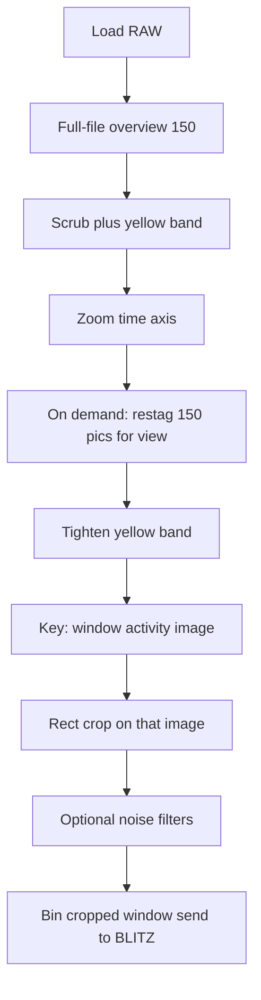
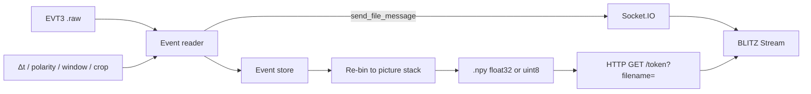

# Event reader

Open **event-camera recordings** (Prophesee / IDS **EVT3** `.raw`) and view them
in [BLITZ](https://github.com/PiMaV/BLITZ) as a normal image stack.

No Metavision / MDK install. The reader decodes the stream once; you choose the
time window, optional crop, and frame time (Δt), then send a dense `.npy` cube
over the same Network contract as **WOLKE** (Socket.IO + HTTP).

Not part of the BLITZ Flatpak or EXE. **Not FUNKE** — that name is reserved for
a later live / multi-cam streamer.



Transport after **Build pictures and send to BLITZ**:



## Download

Release binaries (no Python required):

- **Windows:** `EventReader.exe`
- **Ubuntu / Linux:** `EventReader`

from [GitHub Releases](https://github.com/PiMaV/event-reader/releases).
The one-file binary is around 140 MB (Qt + NumPy + Numba).

Run the binary (optional path to a `.raw` file). On Windows a console window
stays open for logs.

## Use with BLITZ

Nothing is sent until you click **Build pictures and send to BLITZ**.
The coloured bar under the file path is the status (decoding, sending, BLITZ Stream
connected / received) — not a tiny traffic light.

1. **Open** a `.raw` file (**drop** it on the window, **Open RAW…**, or pass
   the path on the command line). The window shows the RAW header and first
   events (about ten lines) plus a coarse **overview** (~150 pictures, local
   only). Dropping a folder loads the first `.raw` in that folder.
2. **Scrub** the timeline under the image (click, drag the white playhead, or
   mouse wheel). Time is **seconds from the first event in this file**, not
   wall-clock. EVT3 ticks are 1 µs; the file does not store when you pressed
   record.
3. **Zoom time** with Ctrl+wheel or right-drag on the rate plot. Wheel without
   Ctrl still scrubs. Double-click the plot to reset to the full file (the
   coarse overview is cached).
4. Drag the **yellow band** to the range you will send. The handles sit
   slightly inside the plot so they are not on the window frame. **Rebuild
   overview for selection (O)** zooms the timeline to that band and re-bins
   the overview there. Overview Δt is never below **1 ms** (fewer pictures
   if the view is short) — finer bins look like empty stripes. Send Δt can
   still go down to 1 µs. Double-click the plot to reset to the full file.
5. **Window max / set crop (M)** builds one activity picture of the yellow
   band (log of event counts, so hot pixels do not crush the structure).
   Drag the **green rectangle** to crop before send — same idea as a BLITZ
   load ROI. **Reset crop** returns to the full sensor. Scrub the timeline
   to leave the activity image.
6. Set **frame time (Δt)** and the File-tab-like options (**8-bit**,
   **Normalize**, **Grayscale**). Optional **noise filter** (off by default):
   1-pixel spatial after binning, and/or a temporal 3×3 neighbour filter on
   the event list. Send twice (off then on) to compare in BLITZ. Default send
   is **float32 event counts** — no clip at 255. RAM yellow ≥ 1/8 of installed
   RAM, red ≥ 1/4; more than 1000 pictures is allowed but uncomfortable in
   BLITZ.
7. In BLITZ → **Stream**: address `http://127.0.0.1:5055`, token `evt` →
   Connect, then send. BLITZ File-tab options (8-bit / Normalize / Grayscale)
   apply on Connect too. **Gzip** is a checkbox, default off (localhost).
   **Log stretch** is only available with 8-bit.

If you send with Δt **below 1 ms** and even/odd rows look very different, the
status bar notes it. That is usually sensor readout, not the EVT3 decoder —
there is no silent deinterlace. Try Δt ≥ 1 ms, or inspect the stack in BLITZ.

| Option | Event reader | BLITZ File tab on Connect |
|--------|--------------|---------------------------|
| 8-bit | optional, default off | applied if checked |
| Normalize | optional, default off | applied if checked |
| Grayscale | on (counts are already one channel) | applied if checked |
| Gzip | opt-in, default off | — |
| Crop | green rectangle after **M**, applied on send | load-dialog ROI (not on Stream ingest) |
| Noise filter | optional, send path only | — |

Do not turn **8-bit** on in both places unless you want two quantizations.

## From source

[uv](https://docs.astral.sh/uv/) recommended:

```bash
uv sync
uv run evt-sidecar path/to/recording.raw
```

Optional: `--host`, `--port`, `--token` (defaults `127.0.0.1`, `5055`, `evt`).

Headless export (no GUI, no server):

```bash
uv run evt-sidecar recording.raw --export-npy out.npy --dt-ms 1 --polarity both
```

Tests: `uv run pytest -q`

## Build binaries (Windows + Ubuntu)

PyInstaller one-file. Build **Windows on Windows**, **Linux on Linux** — there
is no cross-compile.

```bash
uv sync --group dev
uv run pyinstaller EventReader.spec --noconfirm --clean
```

| Host | Output |
|------|--------|
| Windows | `dist/EventReader.exe` |
| Ubuntu / Linux | `dist/EventReader` |

On Ubuntu, Qt needs:

```bash
sudo apt-get install -y libgl1 libglx-mesa0 libxcb-cursor0
```

Same one-liner as above: `./scripts/build.sh`

GitHub Actions **Build Event reader** (`workflow_dispatch`, or a `build*` tag)
runs tests, then Windows + Ubuntu jobs, and publishes both files on a Release
(`EventReader.exe` + `EventReader`).

## Later (backlog)

**Interlace / even–odd rows on binned pictures** — still open. Confirmed on
real recordings **even with overview Δt ≥ 1 ms** (the preview floor does not
remove the stripes). Looks like sensor readout or vendor packing (dark even or
odd lines), not the EVT3 decoder and not a BLITZ LUT. Today the reader only
**warns** when send Δt is under 1 ms and even/odd row means differ a lot. No
merge/interpolate filter until a **known sample** is kept and an optional
deinterlace is designed against it.

**Show noise-filter effect in the sidecar** — today the 1-pixel and temporal
neighbour filters run only on **send** (compare in BLITZ). The overview stays
raw, so you cannot tell in EVT whether a filter helps or how to set it. Apply
the same optional filters to the local preview (overview / window max), keep
them off by default, and expose the knobs (at least neighbour Δt; 1-pixel may
need a neighbourhood size). Do not require a round-trip to BLITZ to tune.

License: [GPL-3.0-or-later](LICENSE).
