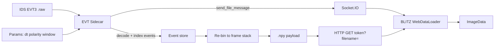

# EVT Sidecar

Standalone companion for **IDS / Prophesee EVT3** recordings. Decodes event
streams, bins them into dense frame stacks with live parameters, and feeds
**BLITZ** over the existing **WOLKE** viewer contract (Socket.IO + HTTP `.npy`).

Not part of the BLITZ Flatpak/EXE. Rare / exotic path — keep BLITZ lean.



## Install

```bash
cd EVT
uv sync
```

## Run (GUI + mini-server)

```bash
uv run evt-sidecar
# or with a file:
uv run evt-sidecar /path/to/recording.raw
```

Defaults: listen `http://127.0.0.1:5055`, token `evt`.

### Connect from BLITZ

1. Start EVT Sidecar and open / apply a `.raw` file.
2. In BLITZ → **Network**: address `http://127.0.0.1:5055`, token `evt`.
3. Change Δt / polarity / window in the sidecar → stack hot-swaps in BLITZ.

## Headless export

```bash
uv run evt-sidecar recording.raw --export-npy out.npy --dt-ms 1 --polarity both
```

## Parameters

| Control | Meaning |
|---------|---------|
| Δt | Bin width (ms) → one frame per bin |
| Polarity | `on` / `off` / `both` / `signed` (ON=+1, OFF=−1) |
| Window | Relative start/end (ms) within the recording |
| Max frames | Cap stack length (default 40; served as uint8 ≈ 0.9 MB/frame at 720×1280) |
| Live apply | Debounced re-bin + push on slider changes |

Output stack shape: `(T, H, W)` float32 (image convention). BLITZ loads via
`DataLoader` and swapaxes into `ImageData`.

## Dependencies

- `numpy`, `numba` — EVT3 decode + binning (no Metavision SDK)
- `flask`, `flask-socketio` — WOLKE-compatible mini-server
- `PyQt6` — sidecar UI

## Layout

| Path | Role |
|------|------|
| `evt_sidecar/raw_header.py` | ASCII `% … % end` header |
| `evt_sidecar/evt3.py` | EVT3 LE decoder → event columns |
| `evt_sidecar/binning.py` | Re-bin to dense stack |
| `evt_sidecar/server.py` | Socket.IO + HTTP `.npy` |
| `evt_sidecar/gui.py` | Parameter UI |
| `evt_sidecar/app.py` | Entry / CLI |

Contract reference: [`../WOLKE/BLITZ_Receiver_Contract.md`](../WOLKE/BLITZ_Receiver_Contract.md).
