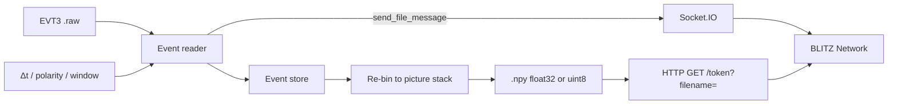

# Event reader

Open **event-camera recordings** (Prophesee / IDS **EVT3** `.raw`) and view them
in [BLITZ](https://github.com/PiMaV/BLITZ) as a normal image stack.

No Metavision / MDK install. The reader decodes the stream once; you choose the
time window and frame time (Δt), then send a dense `.npy` cube over the same
Network contract as **WOLKE** (Socket.IO + HTTP).

Not part of the BLITZ Flatpak or EXE. **Not FUNKE** — that name is reserved for
a later live / multi-cam streamer.



## Download

Release binaries (no Python required):

- **Windows:** `EventReader.exe`
- **Ubuntu / Linux:** `EventReader`

from [GitHub Releases](https://github.com/PiMaV/event-reader/releases).
The one-file binary is around 140 MB (Qt + NumPy + Numba).

Run the binary (optional path to a `.raw` file). On Windows a console window
stays open for logs.

## Use with BLITZ

Nothing is sent until you click **Build pictures and send to BLITZ**.

1. **Open** a `.raw` file. The window shows the RAW header and first events
   (about ten lines) plus a coarse **overview** (~150 pictures, local only).
2. **Scrub** the timeline under the image (click, drag the white playhead, or
   mouse wheel). Time is **seconds from the first event in this file**, not
   wall-clock. EVT3 ticks are 1 µs; the file does not store when you pressed
   record.
3. Drag the **yellow band** to set start → end of the range you will send.
4. Set **frame time (Δt)** and the File-tab-like options (**8-bit**,
   **Normalize**, **Grayscale**). Default send is **float32 event counts** —
   no clip at 255. RAM yellow ≥ 1/8 of installed RAM, red ≥ 1/4; more than
   1000 pictures is allowed but uncomfortable in BLITZ.
5. In BLITZ → **Network**: address `http://127.0.0.1:5055`, token `evt` →
   Connect, then send. BLITZ File-tab options apply on Connect too, including
   **Floor |v|**. **Gzip** is a checkbox, default off (localhost). **Log stretch**
   is only available with 8-bit.

| Option | Event reader | BLITZ File tab on Connect |
|--------|--------------|---------------------------|
| 8-bit | optional, default off | applied if checked |
| Normalize | optional, default off | applied if checked |
| Grayscale | on (counts are already one channel) | applied if checked |
| Floor \|v\| | not in the sidecar | applied if checked |
| Gzip | opt-in, default off | — |

Do not turn **8-bit** on in both places unless you want two quantizations.

## From source

[uv](https://docs.astral.sh/uv/) recommended:

```bash
uv sync
uv run evt-sidecar path/to/recording.raw
```

Optional: `--host`, `--port`, `--token` (defaults `127.0.0.1`, `5055`, `evt`).

Headless export (no GUI, no server):

```bash
uv run evt-sidecar recording.raw --export-npy out.npy --dt-ms 1 --polarity both
```

Tests: `uv run pytest -q`

## Build binaries (Windows + Ubuntu)

PyInstaller one-file. Build **Windows on Windows**, **Linux on Linux** — there
is no cross-compile.

```bash
uv sync --group dev
uv run pyinstaller EventReader.spec --noconfirm --clean
```

| Host | Output |
|------|--------|
| Windows | `dist/EventReader.exe` |
| Ubuntu / Linux | `dist/EventReader` |

On Ubuntu, Qt needs:

```bash
sudo apt-get install -y libgl1 libglx-mesa0 libxcb-cursor0
```

Same one-liner as above: `./scripts/build.sh`

GitHub Actions **Build Event reader** (`workflow_dispatch`, or a `build*` tag)
runs tests, then Windows + Ubuntu jobs, and publishes both files on a Release
(`EventReader.exe` + `EventReader`).

## Later (backlog)

Some recordings look interlaced (dark even/odd lines). That is likely how the
camera wrote the stream, not the EVT3 decoder. No deinterlace filter yet.

License: [GPL-3.0-or-later](LICENSE).
