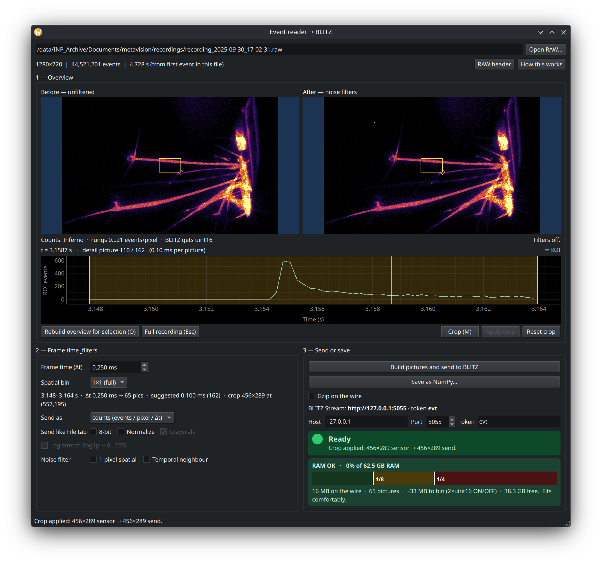
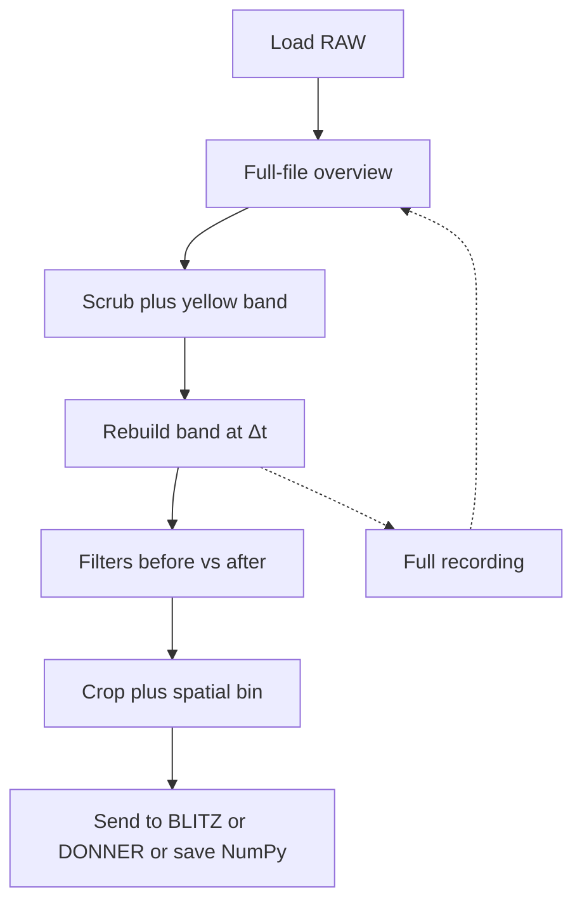
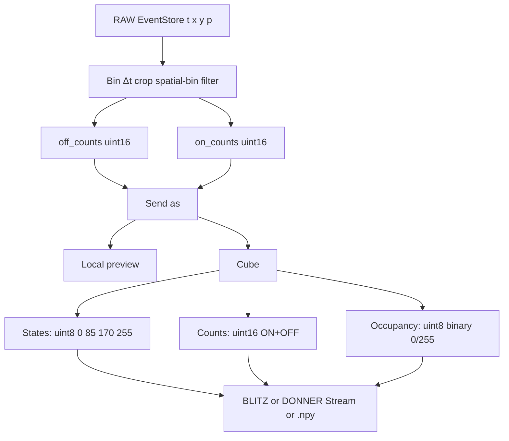

# Event reader

[](https://github.com/PiMaV/event-reader/releases/latest)
[](LICENSE)
[]()
[]()

> **v1.1.0** — EVT3 `.raw` hub for [BLITZ](https://github.com/PiMaV/BLITZ) and [DONNER](https://github.com/PiMaV/DONNER); comfort send readiness and dense voxel count.



Open **event-camera recordings** (Prophesee / IDS **EVT3** `.raw`), inspect them as pictures, then send a dense stack over the **WETTER Viewer Contract** (same Socket.IO + HTTP as **WOLKE**). No Metavision / MDK. Not part of the BLITZ Flatpak or EXE. **BLITZ** and **DONNER** are both clients of that hub — dual 2D/3D view without Viewer↔Viewer sockets.

A later live / multi-cam streamer will be **FUNKE**. This tool is archive → stack.

## WETTER Framework

Event reader is the event-camera archive path into **BLITZ** and **DONNER** (hub role of the Viewer Contract). The imaging pipeline is:

`Raw Data → DAMPF → KEIM → WOLKE → BLITZ`

Overview and module links: **[wetter.mess.engineering](https://wetter.mess.engineering)**



## What’s in 1.1

- Comfort send readiness (2 GiB / 1000 pictures), dense voxel count on the send bar.
- Hub Stream for **BLITZ** and **DONNER**; playhead sync across viewers.
- Guides: **How this works** / **RAW header** / **About** (version, license, links).

## What’s in 1.0

- Drop a `.raw`, scrub a coarse overview, tighten the **yellow band**, **Rebuild (O)** at the send Δt.
- **Crop**, **spatial bin**, optional noise filters (before / after).
- **Send as** is the one choice for what the cube (or `.npy`) holds — the pictures use a matching legend.
- **Build pictures and send**, or **Save as NumPy…** (same cube). Stream clients are **BLITZ** and/or **DONNER**.

Internally the reader always bins **ON and OFF counts** (`uint16`). Send as is a view of those planes — switching it does not re-bin.



## Download

One-file binaries (no Python; about 140 MB, Qt + NumPy + Numba):

- **Windows:** `EventReader.exe`
- **Ubuntu / Linux:** `EventReader`

from [GitHub Releases](https://github.com/PiMaV/event-reader/releases) — start at **[1.1.0](https://github.com/PiMaV/event-reader/releases/tag/build-v1.1.0)**.

Run the binary (optional path to a `.raw`). On Windows a console window stays open for logs.

## Use with BLITZ or DONNER

Nothing is sent until you click **Build pictures and send**. Status and the comfort / RAM bar live in panel **3 — Send or save**.

**Comfort (not share of installed RAM):** green while the wire cube is ≤ **2 GiB** and ≤ **1000** pictures; yellow above that; red from **8 GiB** or **2000** pictures (confirm, still allowed). Send only blocks when the wire would not fit in *free* RAM. The bar also shows dense **voxels** `T × H × W` of the finished package (crop and spatial bin shrink that number).

1. **Open** a `.raw` (drop it, **Open RAW…**, or pass the path). Two pictures: left unfiltered, right after filters. Default view is the **whole frame** (slate-blue letterbox). Dropping a folder loads the first `.raw` in it. A new file resets Δt, filters, Send as, and crop.
2. **Scrub** with the playhead or the wheel. Time is **seconds from the first event in this file** (EVT3 ticks are 1 µs).
3. **Zoom time** with Ctrl+wheel or right-drag. Double-click the plot (or **Full recording / Esc**) restores the cached full-file overview.
4. Drag the **yellow band** to the send range. That writes a 1-2-5 **Δt** (~150 pictures). Typing Δt updates the RAM plan only; **Rebuild (O)** and send re-bin.
5. **Crop (M)** after the band: move the green rectangle, **Apply crop**. **Reset crop** returns to the full sensor.
6. Panel **2**: **Δt**, **spatial bin**, **Send as**, optional 8-bit / Normalize, optional noise filters. Neighbour filter runs on tick, Rebuild, and send — not while you drag the band.
7. Panel **3**: **Build pictures and send**, or **Save as NumPy…**. In BLITZ → **Stream**, or DONNER Source → Count → **Stream**: `http://127.0.0.1:5055`, token `evt` → Connect. DONNER wants **Send as counts** (`uint16` activity).
8. After a send, **playhead sync**: scrubbing in BLITZ (or DONNER) moves the white timeline here to that stack frame; scrubbing the playhead inside the last-sent window pushes the frame index back to connected viewers.

Black pixels are a measured zero. The plot is **event count in the yellow box** (cyan unfiltered, gold filtered). Even/odd row imbalance is reported in the status bar (sensor readout, not the decoder).

For agents: compact product brief in [`docs/llm-brief.md`](docs/llm-brief.md).

| Send as | Preview | Cube |
|---------|---------|------|
| **states** (default) | red / green / yellow | `uint8` 0 / 85 / 170 / 255 |
| **counts** | Inferno | `uint16` activity (ON+OFF) |
| **occupancy** | black / white | `uint8` 0 or 255 |

| Option | Event reader | BLITZ File tab on Connect |
|--------|--------------|---------------------------|
| 8-bit | optional, default off | applied if checked |
| Normalize | optional, default off | applied if checked |
| Grayscale | always (cube is 1 channel) | applied if checked |
| Gzip | opt-in, default off | — |
| Crop | **Crop (M)** then **Apply crop** | load-dialog ROI (not Stream ingest) |
| Spatial bin | 1×1 / 2×2 / 4×4 / 8×8 | — |
| Noise filter | 1-pixel live; neighbour on tick / Rebuild / send | — |

Do not turn **8-bit** on in both places unless you want two quantizations.

## From source

[uv](https://docs.astral.sh/uv/) recommended:

```bash
uv sync
uv run evt-sidecar path/to/recording.raw
```

Optional: `--host`, `--port`, `--token` (defaults `127.0.0.1`, `5055`, `evt`).

Headless (no GUI, no server):

```bash
uv run evt-sidecar recording.raw --export-npy out.npy --dt-ms 1 --representation states --spatial-bin 2
```

Tests: `uv run pytest -q`

## Build binaries (Windows + Ubuntu)

PyInstaller one-file. Build **Windows on Windows**, **Linux on Linux**.

```bash
uv sync --group dev
uv run pyinstaller EventReader.spec --noconfirm --clean
```

On Ubuntu: `sudo apt-get install -y libgl1 libglx-mesa0 libxcb-cursor0 libegl1` (or `./scripts/build.sh`).

GitHub Actions **Build Event reader** (`workflow_dispatch`, or a `build*` tag such as `build-v1.1.0`) publishes `EventReader.exe` and `EventReader` on the Release.

## Later / parked

See suite parking lot
[`../WETTER/TODO.MD`](../WETTER/TODO.MD) (2026-09 Viewer Contract follow-ups):
DONNER Streamer UI for local QA, Open-in/ROI handoffs, WOLKE selection
parity. Event reader playhead ↔ BLITZ `viewer_index` is in.

Also [`BACKLOG.md`](BACKLOG.md) if present. Open item: optional deinterlace
after a known sample.

License: [GPL-3.0-or-later](LICENSE).
