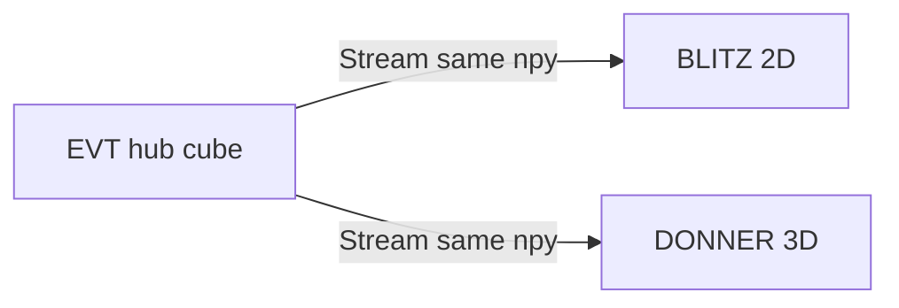

# Event reader — LLM brief

Machine-oriented product picture. Humans use [`README.md`](../README.md); detail and history live in [`CHANGELOG.md`](../CHANGELOG.md) and [`BACKLOG.md`](../BACKLOG.md).

## Boundary

- **Is:** EVT3 `.raw` archive → dense picture stack → **WETTER Viewer Contract** hub (Socket.IO + HTTP `.npy`, same as WOLKE). Local PyQt inspect + one send.
- **Is not:** live multi-cam (**FUNKE** later); not BLITZ Flatpak/EXE; not Metavision/MDK.
- **Viewers:** **BLITZ** (2D LUT / timeline) and **DONNER** (3D count volume). One cube, many clients — not a “BLITZ-only sender”.

## Do

- Bin always **ON+OFF uint16**; **Send as** is a view (states / counts / occupancy) without re-bin.
- Prefer **Send as counts** when the target is DONNER.
- Size the package with yellow band, Δt, **crop**, **spatial bin**, noise filters — those are the prefilters; no separate per-event drop UI.
- Treat send readiness as **comfort**, not “fits in installed RAM”.

## Don’t

- Do not colour readiness from 1/8 or 1/4 of *installed* RAM alone (64 GB boxes looked green at multi-GB sends).
- Do not block large sends except when wire would not fit in *free* RAM (`block`).
- Do not invent a second send button for DONNER — one hub send.
- Do not confuse **dense voxels** `T×H×W` with DONNER occupied cells (~500k comfort there is viewer-side).

## Send comfort (`evt_sidecar/ram.py`)

| Level | Meaning |
|-------|---------|
| **ok** | Wire ≤ **2 GiB** and ≤ **1000** pictures |
| **yellow** | Above that — allowed; confirm |
| **red** | Wire ≥ **8 GiB** or ≥ **2000** pictures (or build buffer tight on free RAM) — confirm |
| **block** | Wire > 90 % *available* RAM — refuse |

Banner also shows **dense voxel count** of the finished cube. Process RSS (Qt, temp `.npy`, second viewer copy, EVT build panes) can exceed wire bytes — that is expected.

## Key paths

| Path | Role |
|------|------|
| `evt_sidecar/gui.py` | PyQt UI, send plan, comfort banner |
| `evt_sidecar/ram.py` | `assess_stack`, comfort thresholds, `fmt_count` |
| `evt_sidecar/binning.py` | Bin + Send-as views + encode |
| `evt_sidecar/server.py` | Hub Socket.IO + HTTP `.npy` |
| `evt_sidecar/playhead_sync.py` | Frame index ↔ timeline |

## Contracts

- Wire cube: always one gray channel. States `uint8` 0/85/170/255; counts `uint16` activity; occupancy `uint8` 0/255.
- Stream: connect `http://127.0.0.1:5055`, token `evt` (defaults). Playhead: `viewer_index` ↔ `send_file_message` with `index`.

## Pointers

- Setup / user steps: [`README.md`](../README.md)
- What changed: [`CHANGELOG.md`](../CHANGELOG.md)
- Parked work: [`BACKLOG.md`](../BACKLOG.md)
